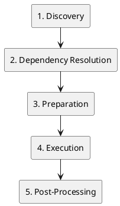

# Build Process Overview

ContainerHive builds container images through a sequential pipeline:

## Pipeline Steps

1. **Discovery** - Find and validate configuration files
2. **Dependency Resolution** - Build dependency graph combining implicit (Dockerfile FROM) and explicit (`depends_on`) dependencies
3. **Preparation** - Apply templates and prepare build contexts
4. **Execution** - Build images sequentially using BuildKit
5. **Post-Processing** - Generate SBOMs, run tests, push to registry
6. **Cleanup** - Remove temporary artifacts and report results

## Key Features

- **Sequential execution** for reliability and predictability
- **Dependency-aware ordering** using topological sorting
- **Template processing** with Go templates
- **Secure secret handling** via BuildKit secret mounting
- **RootFS copying** for derived image scenarios
- **Comprehensive error handling** with detailed reporting