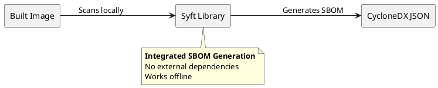

How SBOM generation works
==================

ContainerHive generates Software Bills of Materials (SBOMs) for built images using [Syft](https://github.com/anchore/syft).

## Approach

Syft is integrated as a Go library rather than invoked as an external tool. This means:



- No additional runtime dependencies or Docker-in-Docker setup needed.
- Works in air-gapped and network-restricted environments.
- Operates directly on local OCI tar files produced during the build.

## Output format

SBOMs are generated in [CycloneDX](https://cyclonedx.org/) JSON format. Each image produces a `cyclonedx.json` file in its output directory.

## Usage

```bash
ch sbom
```

The `sbom` command must run after `build`, as it operates on the built image artifacts.
